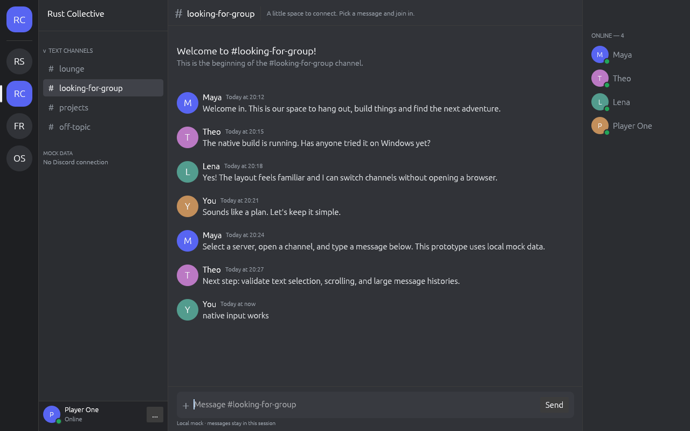

# Rustcord

Discord-style desktop chat UI in Rust, without Electron, Chromium or WebView.
Native window and rendering through egui/eframe + OpenGL; Windows is the primary
target. Familiar Discord layout: server rail, channels, messages, members,
profile and message composer.



**Current build uses local mock data.** There is no Discord login or connection.
The official API does not generally authorize replacement clients for personal
accounts; see [architecture](docs/architecture.md) for researched restrictions.

## Run

Install [Rust stable](https://rustup.rs/) (minimum 1.92). On Windows, install
Visual Studio Build Tools with Desktop development with C++ and Windows SDK.
Use a working OpenGL graphics driver.

```sh
git clone https://github.com/lippdev/rustcord.git
cd rustcord
git switch develop
cargo run -p rustcord
cargo run -p rustcord --release
cargo run -p rustcord --release -- --metrics
```

Linux development needs a C linker, pkg-config, libudev only for the optional
gamepad feature, an OpenGL runtime, libxkbcommon, and an X11/Wayland display.

```sh
sudo apt-get install build-essential pkg-config libgl1 libxkbcommon0
```

Select a server and channel with the mouse. Type in the composer and press
Enter or Send to add a local message. Right-click a message for a local reaction.
The profile's `...` button opens settings; F1 opens settings and Escape closes.
Ctrl+PageUp/PageDown changes server; Ctrl+Up/Down changes channel. Settings and
mock messages reset at exit. Debug metrics are enabled by default; release
metrics require `--metrics` or enabling them in settings.

The controller/TV experience from the first prototype was removed from the
application after clarification of the goal. Gamepad code is parked behind the
optional `input/gamepad` feature, not compiled or initialized in the default app.

## Check

```sh
cargo fmt --all --check
cargo clippy --workspace --all-targets --locked -- -D warnings
cargo test --workspace --locked
cargo build -p rustcord --release --locked
cargo run -p rustcord --release -- --smoke-test
```

The graphical smoke test exercises local channel selection, sending, reaction,
and settings, asserts state, and closes in four seconds. A display is required.
CI is configured for Windows and Linux. Physical Windows validation is pending.

## Structure

`app` composes the native window; `discord-core` owns models/mock/backend boundary;
`app-state` owns state/actions; `input` maps input independently of Discord;
`ui` renders the desktop layout; `platform` samples process metrics.

[Architecture](docs/architecture.md) · [Roadmap](docs/roadmap.md) ·
[Measurements](docs/performance.md)

Official Discord frontend code is not a reusable native Rust UI: it depends on
the web runtime. The project reuses native UI libraries and reimplements the
familiar layout. Visual fidelity and full desktop interactions remain works in
progress. No official logos/assets or proprietary fonts are bundled.

## Contributing

Use small tested commits on Git Flow branches. See [CONTRIBUTING.md](CONTRIBUTING.md).
The current development build and repository default branch are `develop`;
`main` is reserved for releases. Repository: [lippdev/rustcord](https://github.com/lippdev/rustcord).

MIT OR Apache-2.0. Not affiliated with Discord.
